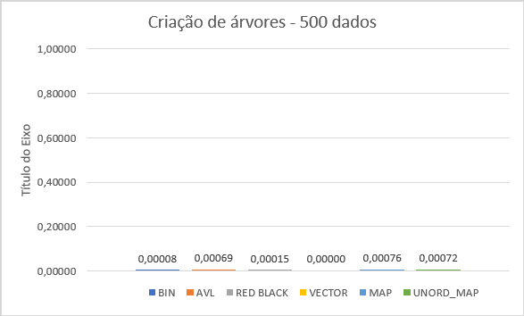
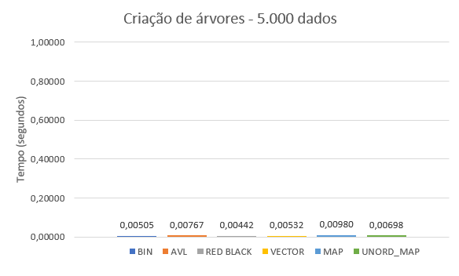
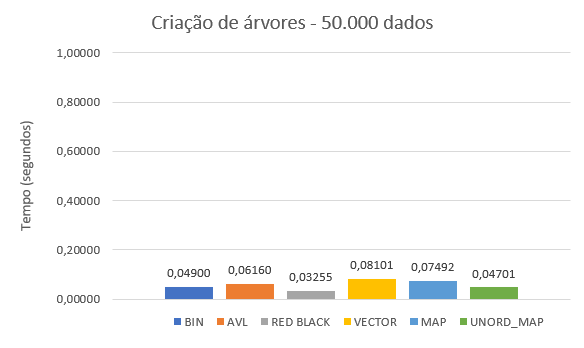
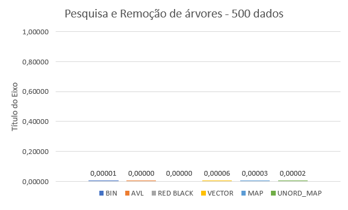
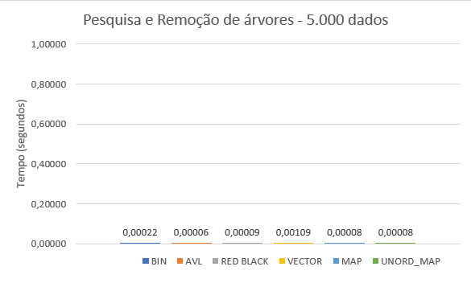
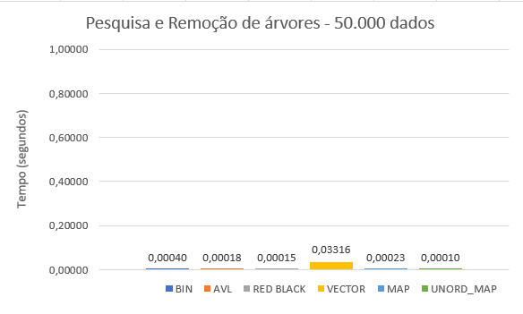

# Comparação de Estruturas de Árvores

Marinêz Werneck Magalhães

## Definição do Projeto

 Até o momento trabalhamos com três modelos de árvore, binária, avl e redblack. Chegou o momento de compararmos tais estruturas, observando seu comportamento sob diferentes volumes de dados. Para tanto, elabore arquivos que contenham 500 , 5000 , 50.000 , 500.000 entradas numéricas do tipo ponto flutuante. Para tanto, tente evitar repetições de valores em grande escala para que possamos ter uma estrutura profunda. Considere produzir os menores a partir dos maiores volumes de forma randômica. Feito a isso, vamos testar os seguintes processos:

1) - Qual o tempo gasto com pesquisa para um arquivo de entrada com 10.000 consultas. Considere como consulta a busca de um determinado número na estrutura escolhida. Para cada pesquisa, é preciso remover o elemento da árvore, retornando esse número para o usuário. Então, considere o processo de remoção como parte final do processo.

2) - Qual o tempo necessário para montar a estrutura em memória.

3) - Qual o ganho dessas estruturas ao compará-las a vetores ordenados e aplicados à pesquisa binária. Qual o tempo gasto com a ordenação do vetor? Foi possível produzi-lo em memória?

4) - Adotando como estrutura o map e unorder_map do C++, há ganhos maiores nesse processo de pesquisa?

Elabore um relatório detalhando a implementação dessas estruturas, funcionamento da aplicação, exemplo de resultado, modo de compilação e conclusões. Considere essa última seção como uma discussão de quando adotar cada estrutura acima citada e o por quê de tal escolha. Para toda essa discussão, apresentar gráficos que demonstrem os resultados obtidos durante o processo de análise. 

## Resultados Obtidos

 As Árvores foram implementadas, baseadas nos arquivos do professor Michel
https://github.com/mpiress

no livro do professor Thomas H. Cormen https://www.cs.dartmouth.edu/~thc/

E a referência de C++ foi obtida no site
https://cplusplus.com/

- 
 O Menu de opções abaixo mostra a impressão dos tempos para criação de cada tipo de árvore, de acordo com a entrada de dados escolhida.

  </img>

- 
 Impressão dos valores encontrados na Pesquisa e posteriormente removidos.

  </img>

Os dados utilizados para pesquisa, estão em um arquivo de entrada "entrada.txt", com 10.000 valores em formato flutuante, com até 8 casas decimais, gerados através de um Gerador (figura abaixo) com 2,2% (220 dados) dos valores não presentes na base de dados que será pesquisada, base esta que também foi gerada pelo mesmo código Gerador, criando assim os arquivos: "500.txt","5000.txt", "50000.txt", "500000.txt"

  </img>

- 
A figura abaixo ilustra a saída dos tempos no terminal. Os dados foram coletados em 6 repetições de cada base de dados, esses dados foram armazenados emplanilha eletrônica onde foram tratados e gerados os gráficos correspondentes.

  </img>

  </img>

  </img>

  </img>

  </img>

  </img>

  </img>

  </img>

  </img>

## Compilação:

| Comando | Função |
|---------| --------|
| `make c` | Limpa tudo, compila e executa |
| `make r` | Compila e executa |

